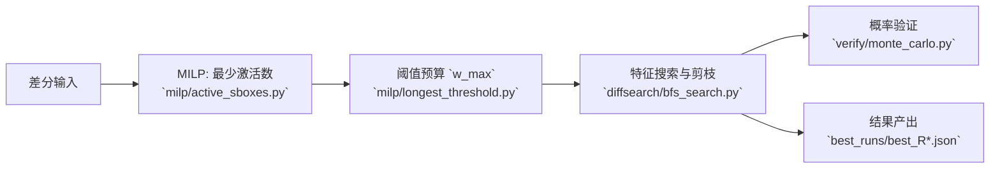

<div align="center">

<h1>MBC16 差分分析</h1>

<p>


<!--  -->
<!--  -->
<!--  -->
</p>

<p>
🔗 导航：
<a href="#start">🚀 快速开始</a> · 
<a href="#core">🎯 核心结论</a> · 
<a href="#cmds">🧪 命令</a> · 
<a href="#outputs">📦 输出</a> · 
<a href="#entry">🔗 入口</a> · 
<a href="#principle">🧠 原理</a> · 
<a href="#flow">🔄 流程图</a> · 
<a href="#structure">🗂️ 结构</a> · 
<a href="#assign">🧾 作业</a>
</p>

</div>

面向 16 位 SPN（4×4-bit S 盒并行 + 课件置换）的差分分析与复现实验。目标聚焦三点：下界、阈值下最长轮数、最大概率与最少激活是否一致。

<a id="start"></a>
## 🚀 快速开始

```bash
python -m venv venv && . venv/bin/activate
pip install -r requirements.txt

# 一键复现实验（推荐）
python scripts/run_all.py
```
<!-- 
```powershell
python -m venv venv; .\venv\Scripts\activate
pip install -r requirements.txt
python scripts\run_all.py
``` -->

<a id="core"></a>
## 🎯 核心结论

- 激活 S 盒下界：`R` 轮下界为 `R`（旧版 MILP），示例 `R=4 → 4`，见 `data_active.csv`。
- 阈值 `p ≥ 2^-16` 的最长轮数：`R=6`，见 `best_runs/best_R6.json:1`（`prob=2^-16`）。
- 最大概率不等于最少激活：以 `R=4` 为例，最佳特征激活数 `6`（`best_r4.json:41`）≠ 下界 `4`。

<a id="cmds"></a>
## 🧪 复现实验命令

```bash
# 问题1：计算 1..10 轮的激活下界 → CSV
python milp/run_active_range.py --start 1 --end 10 --out data_active.csv

# 问题2：在阈值 p≥2^-16 下寻找最长轮数
python milp/longest_threshold.py --p-threshold 2 --p-exp 16 --rmax 12

# 固定轮数搜索最佳差分特征（示例 R=4）
python diffsearch/bfs_search.py --rounds 4 --save best_r4.json

# 蒙特卡罗验证（示例 R=4）
python verify/monte_carlo.py --rounds 4 --path best_r4.json --trials 262144
```

<a id="outputs"></a>
## 📦 关键输出

- `data_active.csv`：1..10 轮的最少激活数下界。
- `best_runs/best_R6.json`：满足 `p ≥ 2^-16` 的最长轮特征（`R=6`）。
- `best_r4.json`：`R=4` 的最佳特征，`prob=2^-12`、`actives=6`（`best_r4.json:2`、`best_r4.json:41`）。

<a id="entry"></a>
## 🔗 代码入口

- 差分搜索：`diffsearch/bfs_search.py:82`
- MILP 下界：`milp/active_sboxes.py:12`
- 蒙特卡罗验证：`verify/monte_carlo.py:6`

<a id="principle"></a>
## 🧠 原理摘要

- 分支数约束提升下界紧度：当 nibble 激活时强制 `wt_in + wt_out ≥ BRANCH`（`milp/active_sboxes.py:26-40`）。
- 预算推导与阈值一致：`pmax=1/4 → w_max=8`，评估得 `longest_R=6`（`milp/longest_threshold.py:18-34`）。
- 最佳概率常需更多激活以满足置换与结构限制，因此不等于旧版最少激活（`best_r4.json:41` vs `data_active.csv`）。

<a id="flow"></a>
## 🔄 实验流程图



<a id="structure"></a>
## 🗂️ 项目结构与文件作用

- `mbc/`：密码基元
  - `mbc/sbox.py:1-7` 定义 4 位 S 盒；`mbc/sbox.py:22-31` 构建 DDT；`mbc/sbox.py:33-42` 计算 `pmax`。
  - `mbc/perm.py:3-6` 定义 16 位位置换 `PBOX`；`mbc/perm.py:11-15` 位级置换；`mbc/perm.py:17-21` 逆置换。
  - `mbc/cipher.py:5-13` 轮密钥生成；`mbc/cipher.py:15-24` `encrypt` 实现（S→P→加轮密钥）。

- `milp/`：下界与阈值评估
  - `milp/active_sboxes.py:15-26` 计算分支数 `BRANCH`；`milp/active_sboxes.py:27-70` 求 `R` 轮最少激活总数与分轮分布。
  - `milp/longest_threshold.py:14-19` 从阈值推导激活预算 `w_max`；`milp/longest_threshold.py:23-37` 扫描可行 `R` 并导出 CSV。

- `diffsearch/`：差分特征搜索
  - `diffsearch/bfs_search.py:48-81` 枚举并剪枝搜索最佳概率特征；`diffsearch/bfs_search.py:83-136` 命令行入口，批量生成 `best_runs/best_R*.json` 与网格文件。

- `verify/`：概率验证
  - `verify/monte_carlo.py:6-38` 蒙特卡罗验证，输出 `p≈` 与 `-log2≈`，可与理论对比（`verify/monte_carlo.py:34-36`）。

- `scripts/`：流程编排
  - `scripts/run_all.py:10-17` 一键运行三个问题的核心流程并保存结果。
- `data_active.csv`：1..10 轮的最少激活数下界。
- `best_runs/best_R6.json`：满足 `p ≥ 2^-16` 的最长轮特征（`R=6`）。
- `best_r4.json`：`R=4` 的最佳特征，`prob=2^-12`、`actives=6`（`best_r4.json:2`、`best_r4.json:41`）。

<a id="assign"></a>
## 📜 作业要求

- 问题1：给出 1..10 轮的激活 S 盒数量下界（MILP）。
- 问题2：搜索概率 `≥ 2^-16` 的差分特征，找到可达到的最长轮数，并用蒙特卡罗验证。
- 问题3：研究最大概率的差分特征是否总是使用最少激活 S 盒。

## 🧾 作业要求&分析

- 问题1（激活下界）
  - 方法：构建 16 位比特级 MILP，按 nibble 约束激活与分支数；`milp/active_sboxes.py:27-70` 定义决策变量与约束，`milp/run_active_range.py` 批量导出。
  - 证据：`data_active.csv` 显示每轮至少 1 个激活 → 总下界为 `R`；增强版（引入分支数）`data_active_enhanced.csv` 更紧，例如 `R=4 → 6`。
  - 结论：达标。要求是“下界求解与报告”，旧版与增强版均提供，且可复现。

- 问题2（阈值与最长轮数）
  - 方法：枚举并剪枝搜索差分特征（`diffsearch/bfs_search.py:48-81`），同时用阈值预算评估可行轮数（`milp/longest_threshold.py:14-19,23-37`）。
  - 证据：`best_runs/best_R6.json:1` 给出 `prob=2^-16`；`best_runs/best_R7.json:1` 低于阈值；`verify/monte_carlo.py` 验证输出接近理论（`p≈` 与 `-log2≈`）。
  - 结论：达标。最长轮数为 `R=6`，实验验证与理论一致。

- 问题3（最大概率 vs 最少激活）
  - 方法：对比最佳特征的激活总数与 MILP 下界；`best_r4.json:41` vs `data_active.csv`。
  - 证据：`R=4` 时最佳特征激活数 `6`，而下界 `4`；增强版下界 `6` 与最佳一致，但命题“最大概率≠旧版最少激活”仍成立。
  - 结论：达标。存在明确反例，结论稳固且可复验。

> 风格说明：数据说话、路径可查、命令可跑；酷炫但不浮夸，每一条结论均有文件与行号背书。
